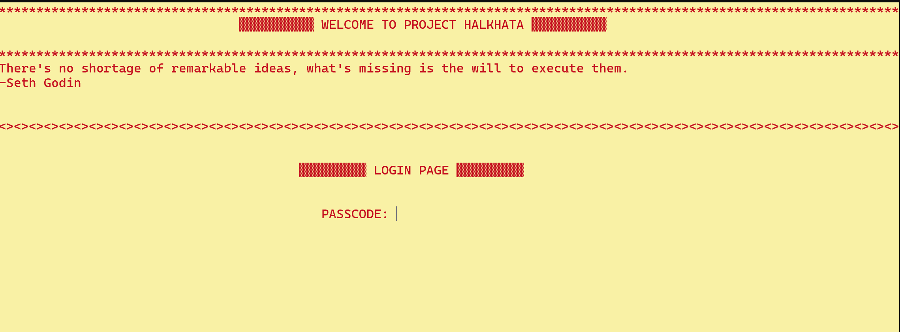

# **Halkhata - Customer Record & Revenue Management System** 🏦📊  

**Halkhata** is a **console-based C program** designed to **manage customer records**, track **pending dues**, and **calculate revenue** for a business. It includes features like **recording transactions, updating customer details, discounting due amounts, and displaying revenue insights** in a structured format. The program ensures persistent data storage through file handling and provides an interactive **menu-driven interface**.  

---

## **📌 Features**  

### ✅ **Customer Record Management**  
- **Add new customers** with a randomly generated **Account Number**.  
- **Store customer details**, including **name, address, phone number, transaction history, and dues**.  
- **View all customer records** with their **dues and payments**.  
- **Edit customer details**, including **address, phone number, and due clearance**.  
- **Delete customer records** when required.  

### ✅ **Financial & Revenue Management**  
- **Check outstanding dues** within a specified range.  
- **Calculate total revenue, pending dues, and payments collected**.  
- **Apply discounts** on customer dues.  
- **Analyze monthly revenue trends** with a **graphical representation using stars (`*`)**.  

### ✅ **Security & User Experience**  
- **Login system with password protection** (`passcode: "satak"`) to ensure secure access.  
- **Color-coded console output** for better readability.  
- **Random motivational quote displayed** on startup.  
- **Smooth user experience** with an intuitive **menu-driven navigation system**.  

---

## **🛠️ Installation and Usage**  

### **1️⃣ Clone the Repository**  
```bash
git clone https://github.com/yourusername/Halkhata---Customer-Record-Revenue-Management-System.git
cd Halkhata---Customer-Record-Revenue-Management-System
```

### **2️⃣ Compile the Code**  
```bash
gcc -o halkhata Project.c
```

### **3️⃣ Run the Program**  
```bash
./halkhata   # For Linux/macOS
halkhata.exe  # For Windows
```

---

## **🖼️ Screenshot**  

Below is an image of the **first console page** when running the program.  

  

---

## **📜 File Structure**  
```
📂 Halkhata---Customer-Record-Revenue-Management-System
 ┣ 📜 Project.c            # Main source code file
 ┣ 📜 README.md            # This file
 ┣ 📜 record.txt           # Stores customer transaction data
 ┣ 📜 console_output.png   # Screenshot of the first console page
```

---

## **📚 Technologies Used**  
- **C Programming**
- **File Handling**
- **ANSI Escape Codes (for colored text on terminal)**
- **Structured Data Storage (using Structs)**
- **Menu-Driven System for Navigation**  

---

## **👥 Contributing**  
Want to improve this project? Follow these steps:  
1. **Fork** the repository.  
2. **Create** a new branch (`git checkout -b feature-xyz`).  
3. **Commit** changes (`git commit -m "Added new feature"`).  
4. **Push** to GitHub (`git push origin feature-xyz`).  
5. **Submit a Pull Request** 🎉.  

---

## **📝 License**  
This project is licensed under the **MIT License**. Feel free to use and modify it.  

---
